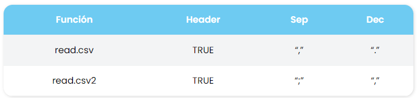

<div style="text-align: right">
  
</div>

<div style="text-align: justify">

# INTRODUCCIÓN

Para inicar el trabajo Estadístico en `R`, es importante primeramente conocer los elementos básicos de la sitaxis de este nuevo lenguaje.

En este material haremos un repaso en este sentido, conociendo los principales objetos que podemos crear en `R`, el tratamiento que podemos darle a estos objeto para generar nueva información.

# Ejecución de instrucciones y comentarios en R

Es importante que el usuario tome en consideración que la creación de documentos `Rmarkdown`  implica una combinación de texto plano y bloques de código (`chunk`), de manera que lo que quede fuera de estos bloques `R` no lo ejecuta.

Para escribir un comentario en un bloque de código en `R`, este debe estar precedido por el símbolo **#**.

La interface de `RStudio` pone a disposición del usuario diferentes opciones en el menú y barra de tareas para la creación de bloques de código y la ejecución de estos de diferentes formas. Seguidamente se resumen algunos atajos de teclado para agilizar el trabajo el `RStudio`:

* `Crtl + Alt + I` : Generar un nuevo boque de código de `R`

* `Alt + -` : permite generar el comando de asignación **<-** 

* `Ctrl + Enter`: ejecuta código línea por línea

* `Ctrl + Alt + R`: Ejecuta todos los bloques de código del documento

## Instalación y cargado de paquetes en R 

Para instalar un paquete en `R` se puede hacer de dos maneras:

1. Usando la herramienta de `RStudio` en la ventana Packages. Se instalan varios paquetes de manera simultánea separando el nombre de estos con espacio o coma. 

2. Con las siguientes instrucciones de código

```install.packages("nombre del paquete", dependencies = T) ```

Si se desea instalar varios paquetes de manera simultánea, solo se debe hacer es el primer argumento de función `install.packages` un vector de caracteres:

```install.packages(c("pack1","pack2",...,"packn"), dependencies = T)```

El siguiente bloque de código lo usaremos para cargas algunas librerías que serán útiles en nuestro trabajo:

```{r}
library(readr)
```


# Solicitando ayuda en R

Para pedir ayuda a `R` se hace mediante el simbólo de interrogación antes del comando respectivo, por ejemplo para pedir ayuda para el comando *matrix* se hace como sigue: **?matrix**

# Cálculos básicos

```{r}
# Potencias
3^4

```

```{r}
# división Entera
31 %/% 7

```

```{r}
# Módulo (Resto)
31 %% 7
```

```{r}
7 * 4 + 3 
pi * 2^3 - sqrt(4)
abs(12-17*2/3-9)
factorial(4)
log(2, 10)
sin(45 * pi / 180)


```


# Secuencias aleatorias

```{r}
sample(5)

```

```{r}
sample(5,3)

```

```{r}
x <- 1:10
sample(x) #muestreo sin reemplazo

```

```{r}
sample(x,replace=TRUE) #Muestro con reemplazo

```

# Funciones comunes en R

En este apartado se destacan algunas funciones de `R` que se usan en el resto de este documento. Por ejemplo:

* `sum()` proporciona la suma de los elementos del argumento. Así, teniendo en cuenta que ```x <- (1, 3, 5)```, ```sum(x)``` daría el valor 9.

* `cumsum()` proporciona un vector con la suma acumulada del vector argumento, por ejemplo, ```cumsum(x)``` daría ```[1] 1 4 9```

* `rowSums()` y `colSums()` suman, por filas y por columnas, respectivamente, los datos de una hoja de datos.

* `prod()` y `cumprod()` son el equivalente a `sum()` y `cumsum()` para el producto.

* `sqrt()` es la función raíz cuadrada.

* `log()` es la función logaritmo natural o neperiano.

* `log10()` es el logaritmo en base 10.

* `exp()` es la función exponencial.

* `max()` y `min()` proporcionan el máximo y el mínimo del argumento (habitualmente, un vector).

* `sort()` proporciona la ordenación de un vector de menor a mayor.

```{r}
x <- c(9,6,45,3,-1,2,-9,9,0)
sum(x)
```

```{r}
cumsum(x)

```

```{r}
max(x)
min(x)

```

```{r}
sort(x)
sort(x, decreasing = T)
```


```{r}
m1 <- matrix(c(45, 23, 66, 77, 33, 44, 56, 12, 78, 23), 2,5)
m1
```

```{r}
rowSums(m1)
colSums(m1)

```

# Importando bases de datos

Existes muchas maneras de cargar estudiantes en `R`, tanto a partir de funciones base de `R` como algunos paquetes que han sido creados para optimizar este trabajo.

Veamos como se carga una base de datos existente en `R`:

```{r}
data("airquality")

# se almacena en una variable para uso posterior

calidadaire <- data("airquality")
head(calidadaire)
```


Seguidamente se muestra un ejemplo para cargar un archivo de tipo `.csv`

```{r}
estudiantes <- read.csv("Datos/EjemploEstudiantes.csv", sep = ";", dec = ",", header = T, row.names = 1)
head(estudiantes, 5)
```

En `R` existen dos instrucciones para leer los estudiantes `read.csv` y `read.csv2` que funcionan de la siguiente manera:

<div style="text-align: right">
  
</div>

Con lo anterior, la base de estudiantes se pudo haber leído de la siguiente manera:

```{r}
estudiantes <- read.csv2("Datos/EjemploEstudiantes.csv", header = T, row.names = 1)
```

La siguiente instrucción del paquete `readr` permite cargar bases de datos de una manera rápida, pero tiene el problema de que no reconoce `row names` en caso de que sea de interés para el usuario, en su defecto, lee esta columna como un tipo caracter y le asigna un nombre por defecto a esta *X1*. 

Al igual que en el caso anterior, existen dos versiones `read_csv`, para separador de columna `,` y `read_csv2`, para separador de columna `;`.

```{r}
dat1 <- read_csv2("Datos/EjemploEstudiantes.csv")
```


Las siguientes funciones permiten obtener información resumida de la base de estudiantes, que siempre es indispensable para el analista durante la etapa inicial de análisis:

```{r}
str(estudiantes)
```


```{r}
summary(estudiantes)
```


## Estadísticas básicas sobre los estudiantes

```{r}
# La Media
mean(estudiantes$Matematica)
```


```{r}
mean(estudiantes$Ciencias)
```


```{r}
mean(estudiantes$Espanol)
```

```{r}
mean(estudiantes$Historia)
```

```{r}
mean(estudiantes$EdFisica)
```

```{r}
# La Desviación Estándar
sd(estudiantes$Matematica)
```

```{r}
sd(estudiantes$Ciencias)
```

```{r}
sd(estudiantes$Espanol)
```


```{r}
sd(estudiantes$Historia)
```

```{r}
sd(estudiantes$EdFisica)
```

# Variables globales y asignación 

En `R` es posible asignar variables globales a partir de los operadores $<-$ o $=$.

```{r}
tasa.interes <- 0.3

tasa.interes
```


```{r}
tasa.interes = 0.3

tasa.interes
```


```{r}
balance.inicial <- 3000
balance.final <- balance.inicial * tasa.interes + balance.inicial
balance.final
```


> **Ejemplo**

Una persona desea sacar un préstamo, de \(P\) colones a una tasa de interés mensual \(i\). El préstamo tiene que ser reembolsado en \(n\) cuotas mensuales de tamaño \(R\), comenzando dentro de un mes. El problema es calcular \(R\). La fórmula \(R\) es:

\[ R = P \cdot \left( \frac{i}{1 - (1 + i)^{-n}} \right) \]

Si supongamos que \(P=150000\), que la tasa de interés es del $2%$ y que le número de pagos es 10. El código en `R` sería:

```{r}
tasa.interes <- 0.02
n <- 10
principal <- 150000
pago <- principal * tasa.interes / (1 - (1 + tasa.interes)^(-n))
pago


```


Si se desea, se puede redondear el resultado:

```{r}
round(pago, digits = 0)
```

`R` es sensible a las mayúsculas y las minúsculas (case-sensitive)

```{r}
x <- 1:10
x
# X (da un error)
```

```{r}
mean(x)
```

Las siguientes instrucciones también reportan un error:

```MEAN(x), Mean(x), mean(X)```

Si se desea observar los objetros que se tienen almacenados en ***Workspace*** (variables globales), se puede usar la siguiente función:

```{r}
objects()
```

# Tipos de datos y objetos en R

En el lenguaje `R` los elementos u objetos que se vayan definiendo, ya se por nosotros mismos o bien como resultado del programa, pueden y deben ser distinguidos para su uso correcto. Concretamente, vamos a hablar de:

* Vectores

* Matrices

* Factores

* Hojas de datos (data frames)

* Listas

Estudiemos las características más relevantes de cada uno de estos objetos:

## Vectores

Un vector en `R` puede contener una colección de números o de caracteres no numéricos. Para definir un vector, por ejemplo, el vector \(x = (1, 3, 5)\), usaremos el comando de concatenación `c()`:

```{r}
x<-c(1,3,5)
```

Así podremos llamar al vector \(x\) en el futuro. Observemos que es la función de concatenación `c()` la que construyó el vector.

También es posible definir un vector de números consecutivos, por ejemplo, el vector $(1, 2, 3, 4, 5)$ mediante:

```{r}
x2 <- 1:5
```

De forma más general, la función `seq(v.ini, v.final,incremento)` permite definir secuencias desde un inicio hasta un \(n\) con una determinada separación entre ellos. Por ejemplo:

```{r}
y<-seq(-3,3,0.5)
y
```

Es útil la función `rep()` para definir vectores como repetición de otros vectores. Por ejemplo, ```rep(0,100)``` devolvería un vector de 100 ceros. O también, ```rep(1:3,3)``` devolvería [1] 1 2 3 1 2 3 1 2 3, veamos:

```{r}
rep(1:3,3)
```

Para determinar la longitud de un vector, se procede:

```{r}
length(x)
```

```{r}
z <- c(1,6,2)
y <- c(1,4,3)

length(z)
length(y)

```

```{r}
z+y
```

```{r}
mean(x)

media_x <- sum(x)/length(x)
media_x
```

# Eliminando variables globales de la memoria de R

```{r}
# Funció0 list objets para ver los objetos que se tienen
ls() 
```

```{r}
rm(x,y,z)
ls()
```


Si se desea remover todas las variables globales, puede usar la siguiente instrucción:

```{r eval=FALSE, include=T}
rm(list = ls())
```

Los vectores también pueden contener caracteres:

```{r}
genero <- c("Masculino","Femenino")
```


Los siguientes vectores siguen una distribución de probabilidad específica:

```{r}
y <-  rnorm(50)
y
```

Hagamos algunos cálculos:

```{r}
mean(y)

```

```{r}
# Varianza
var(y)
```

```{r}
# Desviación estándar
sd(y)
sqrt(var(y))
```

> Indexando un vector en `R`:

```{r}
x<-c(90,98,-10,22,-9,-55,10,230)
x[1]
```

```{r}
x[3]
```

```{r}
x[3:5]
```

Con índices negativos se establece cuáles entradas **no estarán** en el resultado:

```{r}
x[-1]
```

```{r}
x[-3]
```

```{r}
x[-c(2,3)]
```

> Operadores relacionales <,>, ==,<=,!=


```{r}
# Mayor que
a <- c(3, 6, 9, 2, -5)
a > 4
```

```{r}
# Igual
a == 4
```


```{r}
# Mayor o igual que
a >= 4
```

```{r}
# Diferente
a != 4
```

> Ejercicio:

Realice las siguientes consultas:

```{r eval=FALSE, include=T}
a[a > 4]

b <- c(4, 6, 8,12,-2)
a < b

a[a < b]
```


> Operaciones lógicas:

& y | son los operadores *“y”* y *“o”*, respectivamente, por ejemplo:


```{r}
b <- c(4, 6, 8,12,-2)

a[a < b & a < 0]

```

```{r}
a[a < 0 | a >= 6]

```

> Selección condicionada en un vector

```{r}
x<-c(90,98,-10,22,-9,-55,10,230)
x
```

Identifica los negativos:

```{r}
es.neg<-x<0 
es.neg
```
Indexa los valores negaticos en el vector:

```{r}
menores.cero<-x[es.neg]
menores.cero
```

Identifica los pares:

```{r}
es.par<-(x%%2)==0
es.par
```

Idexa los valores pares del vector:

```{r}
pares<-x[es.par]
pares

```


Indexa los valores que son pares y negativos del vector:

```{r}
par.neg<-x[es.par & es.neg]
par.neg

```

> Aritmética de vectores:

Generamos los siguientes vectores:

```{r}
x<-c(90,98,-10,22,-9,-55,10,230)
y<-c(0,-98,45,-3,1,-4,11,23)

```


Realice lo siguiente:

```{r eval=FALSE, include=T}
x+y

2*x

x-5

x^3

x^y

```


> Valores ausentes

Se crea un vector sin elementos:

```{r}
vector <- NULL 
vector
```

```{r}
vector[seq(2, 20, 2)] <- seq(2, 20, 2)
vector
```

```{r}
vector+vector
```


```{r}
3*vector
```

```{r}
x<-c(0,3,4,2)

x/x

1/x
```

> Factores (manejo de variables)

Los factores son un tipo especial de vectores que permiten analizar variables Estadísticas cualitativas nominales u ordinales.

Por ejemplo, considere la variable *país* cuyas modalidades o posibles valores son: “Panamá”,“Costa Rica”,“Nicaragua”,“Honduras”,“El Salvador”,“Guatemala”,“Belice”. 

En `R` se podría tener:

```{r}
pais<-factor(c("Honduras","Costa Rica","Honduras","Belice","Nicaragua"))
pais
```

Note que `R` ordena (Levels) los valores de la variable factor por orden alfabético, pero si no se desea seguir ese orden, sino por ejemplo, el orden en el que los países están ordenados geográficamente en el continente en la dirección de sur a norte, se le puede indicar a `R` con la siguiente instrucción:

```{r}
pais2<- factor(c("Honduras","Costa Rica","Honduras","Belice","Nicaragua"), levels=c("Panamá","Costa Rica","Nicaragua","Honduras","El Salvador","Guatemala","Belice")) 
pais2
```

# Matrices

Una matriz se define mediante la función `matrix()` a la que hay que especificarle los elementos y la dimensión:

```{r}
matriz<-matrix(c(1,2,3,4,5,6,7,8,9,0,0,-1),4,3)
matriz
```

Las dimensiones (nº de filas y columnas) de la matriz pueden obtenerse mediante la función `dim()`:

```{r}
dim(matriz)

```

Si queremos llegar a elementos concretos de una matriz lo haremos utilizando **corchetes** para indicar las filas y columnas:

```{r}
matriz[2,3]

```

```{r}
matriz[1:2,2:3]

```


```{r}
matriz[,c(1,3)]

```

```{r}
matriz[,-c(1,3)]
matriz[,-1]

```

Por otra parte, tanto para los vectores como las matrices las operaciones suma y diferencia funcionan sin mayores complicaciones, sin embargo, en el caso del producto, hay que clarificar que, por ejemplo, `matriz*matriz` devuelve la multiplicación elemento a elemento, es decir:

```{r}
matriz*matriz

```

Mientras que `matriz%*%matriz` sí devuelve el producto matricial, esto es:

```{r}
# La siguiente instrucción da error
# porque no se puede multiplicar una matriz 4x3 por una matriz 4x3
# matriz%*%matriz 

matriz2<-matrix(c(1,2,3,4,5,6),3,2)
dim(matriz2)
matriz2
```

```{r}
matriz%*%matriz2
```


```{r}
dim(matriz%*%matriz2)
```

Instrucciones homólogas:

```{r}
x <- matrix(data=c(1,2,3,4), nrow=2, ncol=2)
x1 <- matrix(c(1,2,3,4),2,2)
x
x1
matrix(c(1,2,3,4),2,2,byrow=TRUE)

```

```{r}
sqrt(x)
x^2

```

> Combinando matrices

Las funciones `cbind()` y `rbind()` se pueden usar para unir dos o más vectores o matrices, ya sea por columnas o por filas respectivamente.

Los siguientes ejemplos pretenden ilustrar esto:

```{r}
m1 <- matrix(c(45, 23, 66, 77, 33, 44, 56, 12, 78, 23), 2,5)
m1
```

```{r}
cbind(c(4, 76), m1[, 4])

```

Note que se unió el vector $(4,76)$ con la columna 4 de la `m1`.

```{r}
m2 <- matrix(rep(10, 20), 4, 5)
m2
```

```{r}
m3 <- rbind(m1[1, ], m2[3, ])
m3
```

Reemplanzando una columna `m1`:

```{r}
m2[,3] <- c(-5,3,-3,0)
m2
```

ahora, reemplazamos una fila en `m2`

```{r}
m2[3,] <- c(1,2,3,4,5)
m2
```

Agregamos una nueva columna a `m2`:

```{r}
m2 <- cbind(m2,c(6,6,6,6))
m2
```

Agreguemos una fila nueva a `m2`:

```{r}
m2 <- rbind(m2,c(5,5,5,5,5,5))
m2
```
# Listas

Como ejemplo, considere una base de datos de empleados. Supongamos que por cada empleado se almacena el `nombre`, `salario` y un `booleano` que indica pertenencia o no al grupo (unión) de empleados.

Podríamos iniciar nuestra base de datos en vacío como sigue:

```{r}
j <- list()
```

Para insertar el primer empleado se puede hacer como sigue:

```{r}
j <- list(nombre="Luis", salario=55000, union=TRUE)
j
```
Los nombres de los elementos, por ejemplo, “salario”, son opcionales. Uno también podría hacerlo de esta manera:

```{r}
j2 <- list("Luis",  55000, T)
j2
```

Los nombres de los elementos en una lista se llaman *tags* y estos se pueden obtener con el operador `names()`:

```{r}
names(j)
```

Para obtener los valores se usa `unlist()`:

```{r}
ulj  <- unlist(j)
ulj
```

El retorno de `unlist()` es un vector modo carácter, o sea, un vector de “strings”.

Las listas de `R` tienen cierta semejanza a los “struct” del lenguaje C, definamos, por ejemplo, una lista x con dos elementos:

```{r}
x <- list(abc="Luis",  de = 5)
x
```
Así la lista **x** tiene dos elementos:

```{r}
x$abc
x$de
```

O sea el operador `$` en `R` funciona como el operador “.” en C.

```{r}
names(x)
ulx <- unlist(x)
ulx
class(ulx)
```

El símbolo *$* se utiliza para designar elementos con nombre de una lista, pero también *[[ ]]* trabaja para hacer referencia a un solo elemento:

```{r}
j$salario
j[[2]]
```


# Hojas de datos (Data frame)

Las hojas de datos constituyen la manera más eficiente mediante la cual `R` puede analizar un conjunto de datos estadísticos. 

Habitualmente se configuran de tal manera que cada fila se refiere a un individuo o unidad estadística, mientras que cada columna hace referencia a una variable estadística.

Esa configuración hace que visualmente una hoja de datos parezca una matriz, sin embargo, como objetos de `R` son cosas distintas, hay que comprender la diferencia y particularidades de cada uno. 

Vamos a ver cómo se construye un `Data fame` con los datos de 3 personas, que incluye el color de sus ojos, su peso y su altura como variable. Empezaríamos definiendo el color de los ojos:

```{r}
ojos<-factor(c("Azules","Marrones","Marrones"), levels=c("Azules","Marrones","Verdes","Negros"))
ojos
```

Supongamos que los pesos y las alturas son, respectivamente, 68, 75, 88 y 1.65, 1.79, 1.85, ntonces, definiríamos la hoja de datos mediante la siguiente instrucción:

```{r}
datos <- data.frame(Color.ojos = ojos, Peso = c(68,75,88),Altura = c(1.65,1.79,1.85))
datos
```

Así, tendremos tres variables, llamadas `Color.ojos`, `Peso` y `Altura`.

Podemos forzar a que una matriz se convierta en una hoja de datos mediante la función `as.data.frame`. Por ejemplo la siguiente instrucción convertirá matriz en una hoja de datos:

```{r}
datos2 <- as.data.frame(matriz)
datos2
```

Si ponemos `names(datos2)` veremos los nombres que para las variables ha elegido por defecto `R`:

```{r}
names(datos2)
```

Si queremos modificar esos nombres de las variables, podemos usar de nuevo la función `names()`, forzando la asignación:

```{r}
names(datos2) <- c("Variable 1","Variable 2","Variable 3")
datos2
```

La manera en que podemos acceder a los elementos de una hoja de datos es doble:

1. Podemos usar el mismo método que para las matrices.

2. Podemos usar el operador *$*

Para obtener los datos de la variable Color.ojos, por ejemplo, escribiríamos:

```{r}
datos$Color.ojos

```

Para saber el número de filas y de columnas de una hoja de datos utilizaremos las funciones `nrow()` y `ncol()`:

```{r}
ncol(datos)
nrow(datos)
dim(datos)
```

*¿Qué ocurre si no estamos seguros de si un objeto de `R` es una hoja de datos o una matriz?*

Existen funciones que nos informan sobre el tipo de los objetos. 

En el caso que nos ocupa, `is.vector()`, `is.matrix()` e `is.data.frame()`. Así, por ejemplo, `is.data.frame(matriz)` devolverá FALSE, mientras que `is.data.frame(datos2)` devolverá TRUE.

También se puede utilizar el operador `class()` que devuelve directamente la clase a la que pertenece el objeto o instancia. Por ejemplo:

```{r}
is.data.frame(matriz)
is.data.frame(datos2)

class(matriz)
class(datos2)

```

Supongamos que tenemos la puntuación en una prueba escrita `X` y en una prueba oral `Y`, de una muestra de 10 personas y que además tenemos el `sexo` para cada persona. La matriz de datos es la siguiente:

```{r}
x<-c(161,203,235,176,201,188,228,211,191,178)
y<-c(159,206,241,163,197,193,209,189,169,201)
sexo <- factor(c("Hombre","Mujer","Mujer","Hombre","Hombre","Hombre","Mujer","Hombre","Mujer","Mujer"))

Datos.Pruebas <- data.frame(Prueba.escrita = x, Prueba.oral = y, Sexo = sexo)
Datos.Pruebas

```

Cada fila representa los datos de un individuo y cada columna las variables con la información de esos individuos.

Si se desea, se pueden agregar nombres a las filas de la siguiente manera:

```{r}
row.names(Datos.Pruebas) <- c("Luis","Maria","Martha","Bernal","Jose","Alfredo","Andrea","Julian","Elena","Margarita")

Datos.Pruebas
```


Recordemos que si queremos ahora trabajar con alguna de esas tres variables tenemos dos opciones:

1. Podemos referirnos a cualquiera de ellas poniendo el nombre de la hoja seguido del símbolo `$` y del nombre de la variable.

2. Podemos usar el número de columna

```{r}
Datos.Pruebas$Prueba.escrita
Datos.Pruebas[,1]

```

```{r}
Datos.Pruebas$Prueba.oral
Datos.Pruebas[,2]

```

```{r}
mean(Datos.Pruebas$Prueba.escrita)
sd(Datos.Pruebas$Prueba.escrita)

```

Por su parte las filas solo pueden ser manipuladas a través del número de fila:

```{r}
Datos.Pruebas[3,]
Datos.Pruebas[8,]

```


# Listas: II Parte

Las listas permiten agrupar o contener cosas como dataframes, matrices y vectores en una misma variable, es decir todos los demás objetos de `R`

Vamos a crear varios objetos en `R` que posteriormente usaremos para construir nuestra lista:

```{r}
# informacion peliculas shrek. Ver video
nombre <- c("Shrek", "Shrek 2", "Shrek Tercero", "Shrek: Felices por siempre")

puntuacion <- c(7.9, 7.2, 6.1, 6.3)

posterior_2005 <- c(FALSE, FALSE, TRUE, TRUE)

# Informacion estrenos de peliculas
warner <- c(20, 20, 16, 17, 17, 22, 17, 18, 19)
disney <- c(11, 13, 11, 8, 12, 11, 12, 8, 10)
fox <- c(18, 15, 15, 15, 16, 17, 15, 13, 11)
 
# crear diferentes estructuras de datos en R
vector_titulos <- nombre
matriz_peliculas <- matrix(c(warner, disney, fox),
                    nrow = 9,
                    ncol = 3)
peliculas_df <- data.frame(nombre,
                           puntuacion,
                           posterior_2005)
```

Para crear una lista vamos a utilizar la función `list` y pasamos como argumentos los elementos que queremos incluir:

```{r eval=FALSE, include=T}
list(objeto1,
     objeto2,
     ...)
```

Podemos cambiar los nombres utilizando la función `names()`. En `R` vamos a crear una lista que contenga el vector de títulos de Shrek y la matriz con la cantidad de películas por productora de cine:

```{r}
# crear lista en R
lista_curso <- list(vector_titulos,
                    matriz_peliculas)
 
# mostrar lista
lista_curso
```

Los dobles corchetes nos indican cuáles son los objetos que componen la lista. Por defecto `R` solo asignó un número a cada objeto, pero sería útil que también tengan nombre.

Seguidamente pondremos nombres a cada objeto de la lista:

```{r}
# cambiar nombre de dataframe
names(lista_curso) <- c('vector',
                        'matriz')
 
# mostrar dataframe (otra vez)
lista_curso
```

Recordemos que para seleccionar elementos de un objeto como `dataframe`, `matrix` o `vector` se utiliza [ ] (un par de corchetes). Con las listas es diferente, porque se usan dobles corchetes [[ ]].

En `R` vamos a seleccionar el vector. Utilizamos su nombre entre doble corchete, luego podemos seleccionar el elemento del objeto vector:

```{r}
# Seleccionar vector de la lista
lista_curso[['vector']] # se recomienda usar este
lista_curso$vector # no se recomienda usar este porque confunde con df
 
# Seleccionar el tercer elemento del vector de la lista
lista_curso[['vector']][3]
 
# Seleccionar fila 5 y columna 3 de la matriz de la lista
lista_curso[['matriz']][5,3]
```

> Agregar o quitar elementos de las listas en R

Si quiero agregar un objeto a una lista, puedo asignarlo con un nombre. Para esto, vamos a seleccionar el objeto con doble corchete y luego vamos a asignar el contenido del dataframe.

Por otro lado, si queremos eliminar un objeto del dataframe podemos seleccionar ese elemento y asignarle el valor NULL

*NULL* es algo asi como un “valor en `R`” que no vale nada, en resumen el *NULL* es algo que está por ahí para poner cuando no hay nada que poner, está vacío.

En `R`, agregamos el dataframe a la lista que habíamos creado: 

```{r}
# agregar dataframe a lista
lista_curso[['dataframe']] <- peliculas_df
 
# revisar que está el dataframe
lista_curso
```


```{r}

lista_curso[['dataframe']]

```

Por otro lado podemos quitar el vector de la lista con NULL:

```{r}
# eliminar un elemento de lista
lista_curso[['vector']] <- NULL
 
# revisar que no está el vector
lista_curso
```

</div>


